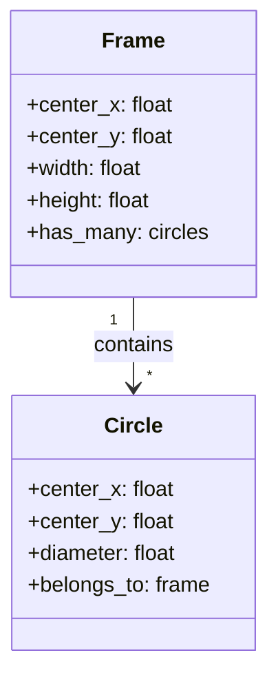

```mermaid
%% Gems Dependency Diagram with Pastel Colors and Emoticons
graph TD
    subgraph "Core Gems"
        Rails[🟢 Rails 8.0.2]
        RSpec[🧪 RSpec 8.0]
        RSwag[📖 RSwag 2.16]
        Brakeman[🛡️ Brakeman]
        SimpleCov[🧪 SimpleCov]
        Puma[🐾 Puma]
        Thruster[🚀 Thruster]
        Rubocop[📝 Rubocop]
    end

    subgraph "Models"
        Frame[🟣 Frame]
        Circle[🟣 Circle]
    end

    Rails --> Frame
    Rails --> Circle
    RSpec --> Frame
    RSpec --> Circle
    RSwag --> Rails
    Brakeman --> Rails
    SimpleCov --> RSpec

    classDef gem fill:#b2f7ef,stroke:#81c784,stroke-width:2px,color:#222;
    classDef model fill:#e1bee7,stroke:#7e57c2,stroke-width:2px,color:#222;
    class Rails,RSwag,Brakeman,SimpleCov,Puma,Thruster,Rubocop gem;
    class Frame,Circle model;
```

```mermaid
%% Mind Map with Pastel Colors and Emoticons
mindmap
  root((🟢 Frames and Circles API))
    Models
      Frame
      Circle
    Services
      FrameCreationService
      FrameDeletionService
      CircleCreationService
      CircleDeletionService
      CircleQueryService
      CircleUpdateService
    API
      FramesController
      CirclesController
      Endpoints
    Database
      PostgreSQL
    Testing
      RSpec
      SimpleCov
    Documentation
      Swagger
      RSwag
    Deployment
      Docker
      Docker Compose
```

```mermaid
%% Deployment Diagram with Pastel Colors and Emoticons
graph TD
    subgraph External[🌐 External Access]
        User[🧑‍💻 User/Client]
        Browser[🌍 Web Browser]
    end
    
    subgraph Docker_Environment[📦 Docker Compose Environment]
        subgraph Web_Container[🟢 Web Container]
            Rails[🟢 Rails API Server]
            Swagger[📖 Swagger UI]
            RSpec[🧪 RSpec Tests]
        end
        
        subgraph Database_Container[🗄️ Database Container]
            PostgreSQL[🗄️ PostgreSQL Database]
        end
        
        subgraph Network[🔗 Docker Network]
            DockerCompose[🔗 Docker Compose Orchestration]
        end
    end

    User --> Rails
    Browser --> Swagger
    Rails --> PostgreSQL
    Rails --> Swagger
    Rails --> RSpec
    DockerCompose --> Web_Container
    DockerCompose --> Database_Container
    PostgreSQL -.-> Rails

    style Rails fill:#b2f7ef,stroke:#388e3c,stroke-width:2px,color:#222
    style Swagger fill:#e1bee7,stroke:#7e57c2,stroke-width:2px,color:#222
    style RSpec fill:#ffe0b2,stroke:#ffb300,stroke-width:2px,color:#222
    style PostgreSQL fill:#cfd8dc,stroke:#607d8b,stroke-width:2px,color:#222
    style DockerCompose fill:#fff9c4,stroke:#ffd54f,stroke-width:2px,color:#222
```

# Rails Frames and Circles Api


**About**

The Frames and Circles API is a Ruby on Rails (API-only) project for managing geometric frames and circles, enforcing strict spatial and geometric rules. It provides a RESTful interface for creating, updating, and querying frames and circles, ensuring circles never touch each other within the same frame, always fit entirely within their parent frame, and frames themselves do not touch or intersect. All measurements are in centimeters, supporting decimal values for precision.

[Project Homepage](https://github.com/enogrob/rails_frames_and_circles_api)

## Contents

- [Summary](#summary)
- [Architecture](#architecture)
- [Tech Stack](#tech-stack)
- [Getting Started](#getting-started)
- [Usage Examples](#usage-examples)
- [Contributing Guidelines](#contributing-guidelines)
- [Troubleshooting](#troubleshooting)
- [License](#license)
- [References](#references)

## Summary


The Frames and Circles API is a robust Ruby on Rails (API-only) application designed to manage geometric frames and circles with strict spatial and geometric rules. Its primary purpose is to provide a reliable RESTful interface for creating, updating, deleting, and querying frames and circles, ensuring high data integrity and adherence to business logic.

Key features include:
- Circles must never touch each other within the same frame.
- Circles must always fit entirely within their parent frame.
- Frames themselves do not touch or intersect.

    

- All measurements are expressed in centimeters, supporting decimal values for precision.
- Business logic is encapsulated in service objects for maintainability and testability.
- Comprehensive model validations enforce geometric constraints at the data layer.
- API endpoints are documented with Swagger/OpenAPI for easy integration and exploration.
- Full test coverage is provided via RSpec, ensuring reliability and confidence in the codebase.
- The project is containerized with Docker Compose and uses PostgreSQL for persistent storage, making it suitable for both local development and production deployment.

## Architecture

The API is structured with:

- **Models**: Frame, Circle
- **Service Objects**: Encapsulate business logic for creation, deletion, querying, and updating
- **Controllers**: RESTful endpoints for frames and circles
- **Database**: PostgreSQL (Docker Compose), SQLite (optional for local dev)
- **API Documentation**: Swagger/OpenAPI via RSwag

```mermaid
%% Architecture Diagram with Pastel Colors and Emoticons
graph TD
    subgraph API_Layer[🟢 API Layer]
        FramesController[🟢 FramesController]
        CirclesController[🟢 CirclesController]
    end
    subgraph Models[🟣 Models]
        Frame[🟣 Frame]
        Circle[🟣 Circle]
    end
    subgraph Services[🧩 Services]
        FrameCreationService[🧩 FrameCreationService]
        FrameDeletionService[🧩 FrameDeletionService]
        CircleCreationService[🧩 CircleCreationService]
        CircleDeletionService[🧩 CircleDeletionService]
        CircleQueryService[🧩 CircleQueryService]
        CircleUpdateService[🧩 CircleUpdateService]
    end
    subgraph Database[🗄️ Database]
        PostgreSQL[🗄️ PostgreSQL]
    end

    FramesController --> Frame
    FramesController --> FrameCreationService
    FramesController --> FrameDeletionService
    CirclesController --> Circle
    CirclesController --> CircleCreationService
    CirclesController --> CircleDeletionService
    CirclesController --> CircleQueryService
    CirclesController --> CircleUpdateService
    Frame --> PostgreSQL
    Circle --> PostgreSQL

    classDef api fill:#b2f7ef,stroke:#81c784,stroke-width:2px,color:#222;
    classDef model fill:#e1bee7,stroke:#7e57c2,stroke-width:2px,color:#222;
    classDef service fill:#ffe0b2,stroke:#ffb300,stroke-width:2px,color:#222;
    classDef db fill:#cfd8dc,stroke:#607d8b,stroke-width:2px,color:#222;
    class FramesController,CirclesController api;
    class Frame,Circle model;
    class FrameCreationService,FrameDeletionService,CircleCreationService,CircleDeletionService,CircleQueryService,CircleUpdateService service;
    class PostgreSQL db;
```



<details>
<summary><strong>1. Gems Dependency Diagram - Dependencies and Models</strong> (Click to expand)</summary>


</details>

<details>
<summary><strong>2. Dependencies and Models</strong> (Click to expand)</summary>


</details>

<details>
<summary><strong>3. Mind Map - Interconnected Themes</strong> (Click to expand)</summary>


</details>

<details>
<summary><strong>4. Deployment Architecture</strong> (Click to expand)</summary>


</details>

<details>
<summary><strong>5. Git Graph - Project Evolution</strong> (Click to expand)</summary>


</details>

<details>
<summary><strong>6. API Documentation - OpenAPI Specification</strong> (Click to expand)</summary>

```mermaid
%% Git Graph with Emoticons
gitGraph
commit id: "rails-setup" tag: "🎉"
commit id: "setup-rspec" tag: "🧪"
commit id: "setup-simplecov" tag: "🧪"
commit id: "setup-rubocop" tag: "📝"
commit id: "setup-openapi-swagger" tag: "📖"
commit id: "add-models-and-migrations" tag: "🟣"
commit id: "add-controllers" tag: "🟢"
commit id: "setup-services-and-routes" tag: "🧩"
commit id: "update-services" tag: "🧩"
commit id: "debug-spec-requests" tag: "🧪"
commit id: "add-unit-tests" tag: "🧪"
commit id: "add-service-tests" tag: "🧪"
commit id: "setup-docker-and-compose" tag: "📦"
commit id: "rubocop-corrected" tag: "📝"
commit id: "add-readme" tag: "📖"
```

> ### Base URL
> - **Development**: `http://localhost:3000`
>
> ### Endpoints Overview
>
> #### Frames API (`/api/v1/frames`)
> - `GET /api/v1/frames` - List all frames
> - `POST /api/v1/frames` - Create a new frame
> - `GET /api/v1/frames/{id}` - Get frame details with statistics
> - `PUT /api/v1/frames/{id}` - Update a frame
> - `DELETE /api/v1/frames/{id}` - Delete a frame
>
> #### Circles API (`/api/v1/circles`)
> - `GET /api/v1/frames/{frame_id}/circles` - List circles in a frame
> - `POST /api/v1/frames/{frame_id}/circles` - Create a circle in a frame
> - `GET /api/v1/circles/{id}` - Get circle details
> - `PUT /api/v1/circles/{id}` - Update a circle
> - `DELETE /api/v1/circles/{id}` - Delete a circle
>
> ### Data Models
>
> #### Frame Schema
> ```json
> {
>   "id": 1,
>   "center_x": 0.0,
>   "center_y": 0.0,
>   "width": 10.0,
>   "height": 10.0,
>   "created_at": "2025-01-01T00:00:00.000Z",
>   "updated_at": "2025-01-01T00:00:00.000Z"
> }
> ```
>
> #### Circle Schema
> ```json
> {
>   "id": 1,
>   "center_x": 1.0,
>   "center_y": 1.0,
>   "diameter": 2.0,
>   "frame_id": 1,
>   "created_at": "2025-01-01T00:00:00.000Z",
>   "updated_at": "2025-01-01T00:00:00.000Z"
> }
> ```
>
> ### Response Codes
> - `200` - Successful GET/PUT requests
> - `201` - Successful POST requests (resource created)
> - `204` - Successful DELETE requests (no content)
> - `404` - Resource not found
> - `422` - Unprocessable entity (validation errors)
>
> ### Interactive Documentation
> Access the full Swagger UI at `/api-docs` when the server is running.

```mermaid
pie
    title 🧪 Overall Coverage
    "✅ Covered (587 lines)" : 587
    "❌ Missed (2 lines)" : 2
```

```mermaid
%% File-by-file coverage bar chart
graph TD
    frames_controller["🟡 frames_controller.rb\n97.06%"]:::partial
    circle_model["🟡 circle.rb\n97.50%"]:::partial
    circles_controller["🟢 circles_controller.rb\n100%"]:::full
    application_controller["🟢 application_controller.rb\n100%"]:::full
    application_record["🟢 application_record.rb\n100%"]:::full
    frame_model["🟢 frame.rb\n100%"]:::full
    circle_creation_service["🟢 circle_creation_service.rb\n100%"]:::full
    circle_deletion_service["🟢 circle_deletion_service.rb\n100%"]:::full
    frame_creation_service["🟢 frame_creation_service.rb\n100%"]:::full
    routes["🟢 routes.rb\n100%"]:::full
    circle_spec["🟢 circle_spec.rb\n100%"]:::full
    frame_edge_cases_spec["🟢 frame_edge_cases_spec.rb\n100%"]:::full
    frame_spec["🟢 frame_spec.rb\n100%"]:::full
    circles_spec["🟢 circles_spec.rb\n100%"]:::full
    frames_spec["🟢 frames_spec.rb\n100%"]:::full
    circle_creation_service_spec["🟢 circle_creation_service_spec.rb\n100%"]:::full
    circle_deletion_service_spec["🟢 circle_deletion_service_spec.rb\n100%"]:::full
    swagger_helper["🟢 swagger_helper.rb\n100%"]:::full

    classDef full fill:#b2f7ef,stroke:#81c784,stroke-width:2px,color:#222;
    classDef partial fill:#fff9c4,stroke:#ffd54f,stroke-width:2px,color:#222;
```

</details>

<details>
<summary><strong>7. Test Coverage Results</strong> (Click to expand)</summary>





**Summary:**  
- **All Files:** 99.66% covered at 2.63 hits/line  
- **18 files in total**  
- **589 relevant lines, 587 lines covered, 2 lines missed**  
- **Only 2 files have missed lines:**  
  - `app/controllers/api/v1/frames_controller.rb` (1 missed)
  - `app/models/circle.rb` (1 missed)

</details>

## Tech Stack

- Ruby 3.2.2
- Rails 8.0.2 (API-only)
- PostgreSQL
- RSpec, SimpleCov
- RSwag (Swagger/OpenAPI)
- Docker, Docker Compose
- Brakeman, Rubocop

## Getting Started

1. Clone the repository:
   ```sh
   git clone git@github.com:enogrob/rails_frames_and_circles_api.git
   cd rails_frames_and_circles_api
   ```
2. Set up environment variables (RAILS_MASTER_KEY from `config/master.key`)
3. Build and start containers:
   ```sh
   docker compose build
   docker compose up
   ```
4. Set up the database:
   ```sh
   docker compose exec web bin/rails db:setup
   docker compose exec web bin/rails db:test:prepare
   docker compose exec web bin/rails db:migrate RAILS_ENV=test
   ```
5. Run tests:
   ```sh
   docker compose exec web bundle exec rspec
   ```
6. Access the API at [http://localhost:3000](http://localhost:3000)
7. View Swagger docs at [http://localhost:3000/api-docs](http://localhost:3000/api-docs)


## Usage Examples

**Create a Frame**
```sh
curl -X POST http://localhost:3000/api/v1/frames \
  -H "Content-Type: application/json" \
  -d '{"center_x": 0, "center_y": 0, "width": 10, "height": 10}'
```

**Add a Circle to a Frame**
```sh
curl -X POST http://localhost:3000/api/v1/frames/1/circles \
  -H "Content-Type: application/json" \
  -d '{"center_x": 1, "center_y": 1, "diameter": 2}'
```

**List Circles in a Frame**
```sh
curl http://localhost:3000/api/v1/frames/1/circles
```

**Delete a Frame**
```sh
curl -X DELETE http://localhost:3000/api/v1/frames/1
```

## Contributing Guidelines

- Fork the repository and create a feature branch
- Follow Ruby and Rails style guides (Rubocop enforced)
- Write RSpec tests for new features and bug fixes
- Submit pull requests with clear descriptions
- Report issues via GitHub Issues
- Ensure all tests pass before submitting changes

## Troubleshooting

**403 Blocked Host error:** Add `config.hosts << "www.example.com"` to `config/environments/test.rb`.

**Database adapter error (pg not found):** Add `gem "pg"` to your Gemfile and rebuild Docker.

**Container fails to start:** Check logs with `docker compose logs web` and ensure all environment variables are set.

## License

MIT License (see LICENSE file)

## References

- [Project Requirements](src/requirements.md)
- [Rails Guides](https://guides.rubyonrails.org/)
- [RSwag](https://github.com/rswag/rswag)
- [Docker Compose Docs](https://docs.docker.com/compose/)
- [RSpec](https://rspec.info/)
